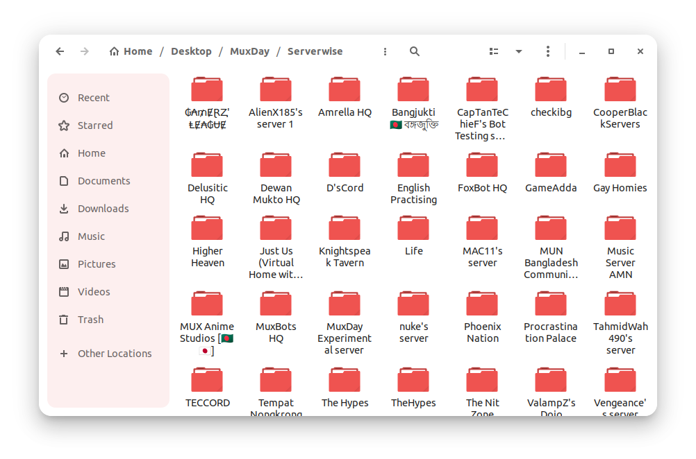
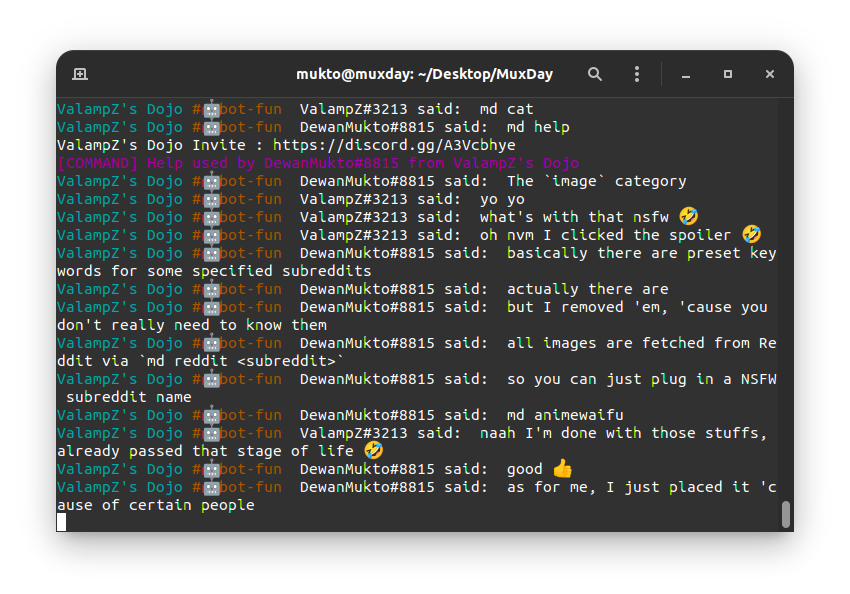

# Serverwise

### Message logging system for Discord bots. Primarily written for bots following the Discord.js API (Node.js).

- [x] 💬️ Auto-record messages across multiple servers
- [x] 😴️ Store activities and track suspicious behavior while you're AFK
- [x] ♻️ Keep permanent backup records of messages as a recovery
- [x] 👀️ Know who sends what, even if they delete their messages


## Overview
> Made as part of [MuxDay](https://github.com/muxworks/MuxDay) back in May 2022. Now discretely available for integrating this simple but effective algorithm into your bots with ease!
The main program/algorithm is very simple. It just relies on a single function (I named it `logwrite` by default, but doesn't have to be the same name),
```javascript
logwrite(msg,server,chatroom);
```
where the message, the server and text channel identifiers are passed down. Then, they are stored in a plain text file on your bot's hosting storage, be it a web server or your own device. Each `MESSAGES.log` file is stored within subfolders relating to the text channel it was recorded from, which are located in folders named after the servers themselves.

## Terms Of Use
> Use with caution. Use at your own risk. By using or relying on this source of information, you agree to be held liable legally for any damages or charges accrued via the means of using this program snippet.

## How To Use
Assuming you have a seperate file for tracking the Discord client event `messageCreate`, you first import `fs` for file handling.
```javascript
const fs = require('fs');
```
And then simply define this function:
```javascript
function logwrite(msg, server, chatroom) {
fs.mkdirSync('Serverwise/'+String(server)+'/'+String(chatroom)+'/', { recursive: true });
fs.appendFileSync('Serverwise/'+String(server)+'/'+String(chatroom)+'/'+'MESSAGES.log', msg+'\n',
function (err) {if (err) throw err; });
};
```
Now within the scope of your program where your bot is supposed to detect messages sent by users, embed the function call, i.e.
```javascript
if (message.content) { 
// ... other lines of code
logwrite(`[${String(new Date).split(" ", 5).join(" ")}]`+ String(message.author.username) + "#" + String(message.author.discriminator) + " said: " + String(message.content), message.channel.guild.name, message.channel.name);
// ... other lines of code
};
```
And that's it! You're good to go!

### Example directory from [MuxDay](https://github.com/muxworks/MuxDay)


Have fun spying on your friends' servers or doing whatever your evil heart desires. I don't know what to advise you; I'm not your parent to tell you what's right and wrong.

## Bonus : Terminal Output
> This is an optional modification where you can temporarily monitor the activities straight from the bot's terminal.
Just like setting up the function above, you can have the message logs displayed in real-time on the console/terminal/CLI of your bot. All you have to do is add in this little snippet right before or after the `logwrite` function call.
```javascript
if (message.content) { 
// ... other lines of code
console.log('\x1b[36m%s\x1b[0m',message.channel.guild.name,"\x1b[33m#"+message.channel.name,"\x1b[0m", message.author.username + "#" + message.author.discriminator, "said: ", message.content);
// ... other lines of code
};
```
Don't worry about the weird escape characters and strings in front of the variables. They're there to 'color-code' the output neatly.

The end result would be something like this:


## Trivia
- This is a slightly more advanced version of the same [Discord Server Logger](https://github.com/dmimukto/discord-server-logger) algorithm I had posted for a Discord.py bot much earlier in 2021.
- I don't have too many 'fully original' works on Github yet, so this little algorithm is one of the few at the moment.
- In case you're too lazy or inexperienced with Discord.js, you can just find a way to integrate [this preset file](/messageCreate.js) with your bot. Although it may be trickier than trying to just add in the functions yourself.
